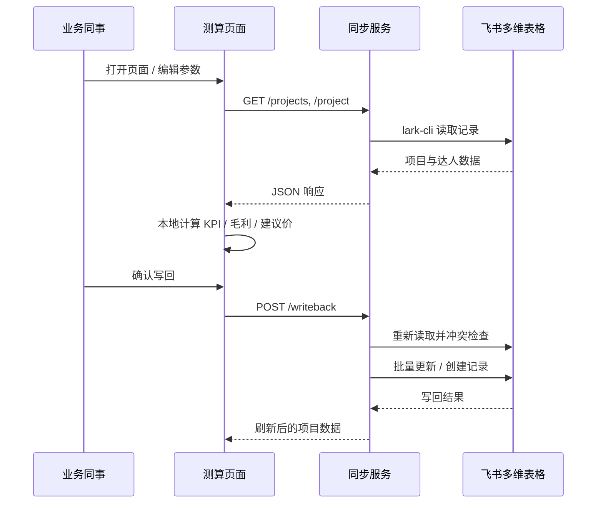

# 达人报价测算器

> 面向短视频达人采买的内部报价与保量测算工具。

输入采买成本、客户 CPM、自然播放和目标毛利率，即可自动计算 KPI 播放量、保量成本、建议卖价与实际毛利，并可在严格保护下同步回现有飞书多维表格。

**当前状态：** 可用于本地业务测算；已通过最小权限的飞书企业自建应用读取现有多维表格，并完成内网部署前的源码脱敏与技术交接准备。

> 本仓库不包含任何真实项目、达人数据、飞书登录状态或密钥。

飞书接入使用企业自建应用“达人保量报价测算”。App ID 和最小权限清单见 [飞书与权限配置](docs/02-飞书与权限配置.md)，App Secret 不在仓库中保存。

## 产品能力

- 多项目切换，与飞书多维表格同步项目参数和达人明细；
- 基于采买成本、客户 CPM、自然播放、其他成本及目标毛利率实时测算；
- 当前报价、建议价、批量恢复建议价与 KPI 播放量自动联动；
- 写回前展示变更清单，写回时再次检查冲突并要求项目 ID 确认；
- 新达人按抖音号去重后追加写入，并自动关联对应项目；
- 页面本地删除仅影响待测算列表，不会删除飞书中的原始记录。

## 系统结构


页面负责展示和计算；同步服务负责读取及受保护的写回；飞书多维表格仍是业务数据的唯一来源。

## 项目分析

### 技术栈

| 层级 | 技术 | 说明 |
| --- | --- | --- |
| 前端框架 | React 19 + Next.js 16（vinext） | 单页测算界面，基于 Vite 8 构建 |
| 样式 | Tailwind CSS 4 | 全局样式见 `app/globals.css` |
| 语言 | TypeScript 5.9 | 前端类型约束；同步服务为原生 ESM |
| 同步服务 | Node.js HTTP + lark-cli | 独立进程，默认监听 `3001` 端口 |
| 运行时 | Node.js >= 22.13 | 开发与构建均要求此版本 |
| 部署目标 | Cloudflare Workers（vinext） | 通过 `worker/index.ts` 适配边缘部署 |

### 目录结构

```text
creator-pricing-calculator/
├── app/                      # 前端页面与样式
│   ├── page.tsx              # 主界面：计算、同步、写回、CSV 导出
│   ├── feishu-snapshot.ts    # 离线演示数据（飞书不可用时兜底）
│   ├── layout.tsx            # 页面布局与元信息
│   └── globals.css           # 全局 UI 样式
├── scripts/
│   ├── dev.mjs               # 同时启动页面与同步服务
│   ├── feishu-sync-server.mjs # 飞书读写 API 服务
│   ├── vinext-run.mjs        # 构建/启动封装（含 Windows 补丁）
│   ├── patch-vinext-windows.mjs # Windows 静态资源路径修复
│   └── windows/              # Windows 一键启动器
├── worker/                   # Cloudflare Workers 入口
├── tests/                    # 构建产物与写回保护测试
├── docs/                     # 业务、权限、部署与验收文档
├── start-windows.cmd         # Windows 双击启动
└── .env.example              # 环境变量模板
```

### 核心模块

**1. 报价测算（`app/page.tsx`）**

- 全部计算在浏览器本地完成，不依赖服务端算力；
- 核心公式：
  - KPI 播放量 = 当前报价 ÷ 客户 CPM × 1000
  - 保量成本由 KPI 播放量与保量成本 CPM 推导
  - 建议卖价在满足客户 CPM 与目标毛利率前提下计算，支持百元/千元取整
- 支持手动改价、批量恢复建议价、达人增删复制、抖音号重复检测；
- 页面草稿持久化到 `localStorage`，键名 `creator-pricing-calculator-v5-multiproject`。

**2. 飞书同步服务（`scripts/feishu-sync-server.mjs`）**

- 通过 `lark-cli` 调用飞书多维表格 API，身份由 `LARK_IDENTITY`（推荐 `bot`）控制；
- 大体积 JSON 请求写入 `.feishu-sync-tmp/` 临时文件（已加入 `.gitignore`）；
- 写回前重新读取飞书数据，逐字段比对 `before` 值，发现冲突返回 `409`；
- 新达人按抖音号去重后批量创建，每批最多 200 条。

**3. 开发/构建脚本**

- `npm run dev`：并行启动同步服务（3001）与页面 dev 服务（3000）；
- `npm run build` / `start`：生产构建与启动；
- Windows 额外执行 `patch-vinext-windows.mjs`，修复 vinext 静态资源路径分隔符问题。

### 同步服务 API

| 方法 | 路径 | 作用 |
| --- | --- | --- |
| GET | `/health` | 健康检查，返回配置状态与 `sourceUrl` |
| GET | `/projects` | 项目列表 + 多维表格跳转地址 |
| GET | `/project?name=` | 读取单个项目及达人明细 |
| POST | `/writeback` | 受保护写回，含冲突检测与项目 ID 校验 |

前端通过 `NEXT_PUBLIC_SYNC_ROOT` 连接同步服务。本地默认 `http://127.0.0.1:3001`，内网部署建议改为同域 `/api` 并由反向代理转发。

### 飞书字段映射

**项目表**：项目名称、项目编号、客户名称、保量成本 CPM、默认客户 CPM、默认目标毛利率、报价取整方式等。

**达人表**：达人名称、抖音号、所属项目、采买成本、当前报价、客户 CPM、预计自然播放、KPI 播放量、保量成本、总成本、实际毛利率、最高可承受采买成本、风险状态等。

详细权限要求见 [飞书与权限配置](docs/02-飞书与权限配置.md)。应用需开通 `base:record:read/create/update`，且被添加为目标多维表格的「可编辑」应用。

### 启动方式

| 场景 | 命令 |
| --- | --- |
| 本地开发（macOS / Linux） | `npm run dev` |
| 仅启动页面 | `npm run dev:site` |
| 仅启动同步服务 | `npm run dev:sync` |
| Windows 一键启动 | 双击 `start-windows.cmd` 或 `npm run start:windows` |
| 打包 Windows exe | `npm run build:win-exe` → `dist/start-calculator.exe` |
| 生产构建 | `npm run build && npm run start` |

### 数据流与职责边界



- **飞书**：业务数据唯一来源，同事可直接在表格中编辑；
- **页面**：计算、预览变更、本地草稿，删除达人不影响飞书记录；
- **同步服务**：读写代理，不承担报价计算。

### 当前状态与限制

**已具备**

- 完整的本地测算、多项目切换、写回保护与新达人追加；
- 飞书企业自建应用最小权限接入（本地通过 `lark-cli`）；
- Windows 兼容（路径补丁 + 启动器）；
- 源码脱敏、环境变量化、内网部署文档。

**上线前待完成**

- 生产环境改用 App ID / App Secret 直连飞书 OpenAPI，替代 `lark-cli`；
- 接入公司 SSO / VPN / 内网访问控制；
- 写回审计日志与生产监控；
- 临时 JSON 文件（`.feishu-sync-tmp/`）目前无自动清理，长期运行可能累积。

**版本**：`v1.0.0` 技术交接版（详见 [更新记录](CHANGELOG.md)）。

## 快速开始

环境要求：Node.js 22.13 或更高版本。

1. 复制 `.env.example` 为 `.env`。
2. 填写飞书连接参数（真实配置不可提交）。
3. 执行 `npm ci` 安装依赖。
4. 执行 `npm run dev` 启动本地页面；Windows 用户也可双击 `start-windows.cmd`。

未配置飞书时，页面仍会展示匿名演示数据；同步和写回接口会返回明确的配置提示。

## 文档导航

| 文档 | 适用对象 | 内容 |
| --- | --- | --- |
| [项目概览](docs/00-项目概览.md) | 产品、业务、技术 | 目标、范围、术语与版本状态 |
| [功能与数据边界](docs/01-功能与数据边界.md) | 业务、技术 | 计算逻辑和写回规则 |
| [飞书与权限配置](docs/02-飞书与权限配置.md) | 飞书管理员、技术 | 现有表格接入和权限要求 |
| [内网部署建议](docs/03-内网部署建议.md) | IT、技术 | 推荐架构和上线前条件 |
| [验收清单](docs/04-验收清单.md) | 测试、业务、技术 | 上线验收项 |
| [更新记录](CHANGELOG.md) | 全体 | 版本变更说明 |

## 开发与交付约定

- 请阅读 [贡献规范](CONTRIBUTING.md) 后再提交代码；
- 安全问题与密钥处理遵循 [安全说明](SECURITY.md)；
- 当前代码仅用于公司内部评审和部署，不得将真实业务数据提交至仓库。
